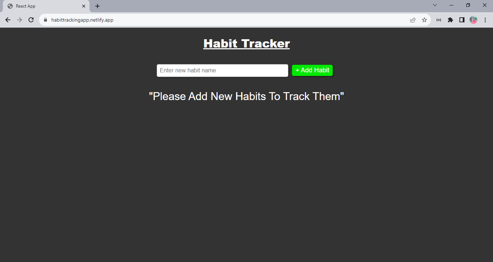
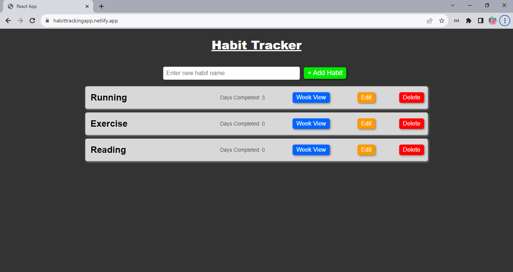
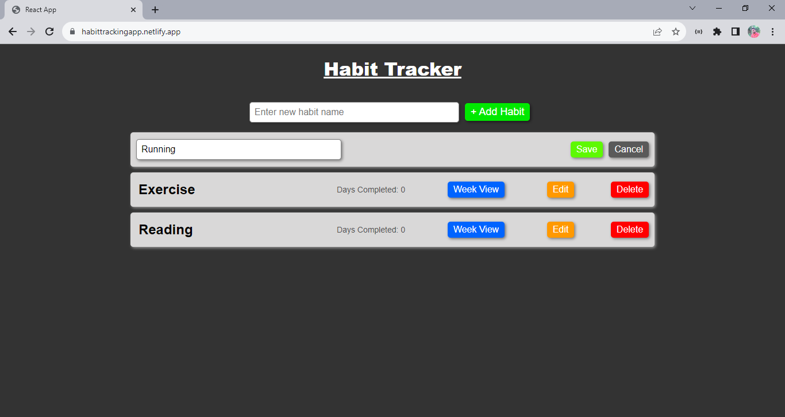
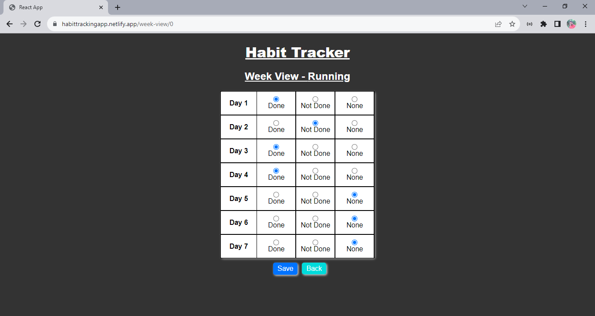

# Habit Tracker App

This is a Habit tracking app in which we can add new habits as many habits as we want and track them on day bacis that how efficiently we complete the bahit on daily basis.

## Functionality:
1. we can add new habit in habit list.
2. We can rename the name of habit.
3. We can delete any habit from habit list.
4. Track our habits on the week basis. 

## Hosted-Link:
[https://habittrackingapp.netlify.app](https://habittrackingapp.netlify.app)

## Screenshot: Landing-Page:

## Screenshot: Habit added:

## Screenshot: Rename-Habit-Name:

## Screenshot: Week-View-Page:
